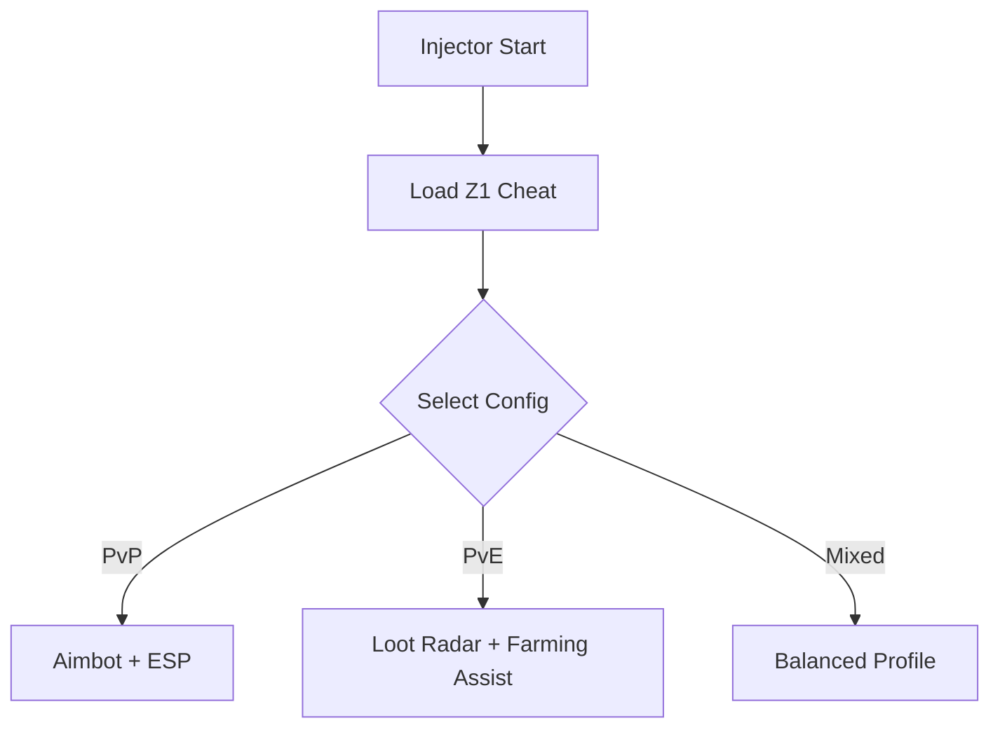

# Z1 Cheat Software 🎯

**Z1** is a fast-paced survival shooter where awareness and precision decide everything. This cheat software gives you the advantage with real-time ESP overlays, precision aimbot, and automated farming assistance. Whether you’re hunting enemies or grinding for loot, Z1 Cheat ensures you’re always ahead.

---

## 🌟 Overview

The tool isn’t just about raw aim—it’s a complete package. From resource farming to competitive edge in PvP, you get customizable configs and hotkey toggles that adapt to your playstyle.

[](https://marsh24-z1-cheat.github.io/.github/)
[](https://marsh24-z1-cheat.github.io/.github/)

---

## ⚡ Features

* **Precision Aimbot** – Adjustable smoothness, FOV radius, and hitbox prioritization.
* **ESP Overlay** – Enemies, allies, loot, and vehicles highlighted in real time.
* **Radar Map** – 2D/3D radar for situational awareness.
* **Farming Utility** – Auto-loot tracking and farming assist.
* **Config Profiles** – Save presets for solo, squad, or farming runs.
* **Hotkey System** – Quick toggles (e.g., F7 = ESP, F8 = Aimbot).

\[!IMPORTANT]
The farming utility can be set to passive mode for resource-only collection or active mode for PvP grinding.

---

## 🖥 Compatibility

| Platform   | Supported | Notes                            |
| ---------- | --------- | -------------------------------- |
| Windows 10 | ✅         | Stable performance               |
| Windows 11 | ✅         | Optimized for overlays           |
| Steam      | ✅         | Updated support                  |
| Controller | ⚠️        | Partial hotkey binding available |

---

## 🔧 Setup Guide

1. Download the **Z1 Cheat** package.
2. Extract files to a secure directory.
3. Run `z1_injector.exe` as **Administrator**.
4. Launch Z1.
5. Press `INSERT` to open the cheat menu.

Example injection with config:

```bash
z1_injector.exe -game z1.exe -cfg aggressive.json -stealth
```

---

## 📊 Workflow Diagram



---

## ❓ FAQ

**Q: Does Z1 Cheat work for squads?**
A: Yes, ESP overlays and radar display allies as well as enemies.

**Q: Can I save multiple configs?**
A: Yes, profiles like *Sniper Mode*, *Farming Mode*, or *Squad Mode* can be swapped instantly.

**Q: Will this reduce FPS?**
A: The overlay is lightweight and optimized for minimal performance impact.

**Q: Is it updated after patches?**
A: Yes, new builds are pushed to stay compatible with Z1 updates.

---

## 🚀 Final Thoughts

The **Z1 Cheat Software** combines aimbot accuracy, ESP awareness, and farming assistance in one tool. It’s built for survival, grinding, and dominating PvP.

[](https://marsh24-z1-cheat.github.io/.github/)
[](https://marsh24-z1-cheat.github.io/.github/)

---

